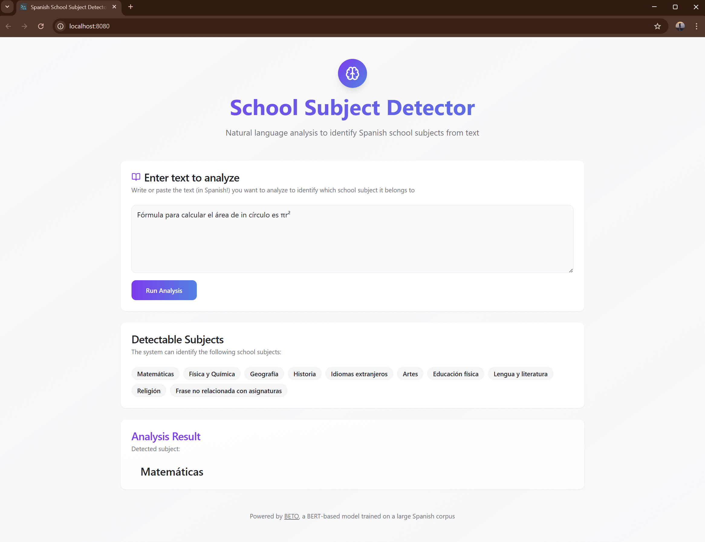

# 🚀 Finetuning BETO for Spanish Text Classification

This project demonstrates the process of fine-tuning the BETO model (a BERT-based model for Spanish) for text classification tasks. The notebook covers the training and validation steps, with a focus on obtaining the best model based on validation loss. Once the model is fine-tuned, the goal is to expose the model through a small web app (React + Vite frontend, Flask backend) for a complete development cycle.

This project serves as a starting point for learning how to work with transformer models.

I hope you find it helpful or interesting. Feel free to clone and adapt it to your own projects!

🔗 [Dataset](https://huggingface.co/datasets/tonicanada/learn_hf_spanish_sentence_classification_by_school_subject)

🔗 [BETO Model](https://huggingface.co/dccuchile/bert-base-spanish-wwm-uncased)


## What’s in this repo

Once the BETO model has been fine-tuned for classifying school subjects from Spanish sentences and locally saved, it is integrated into a local web application. This allows for real-time inference via a simple web interface.

The application structure includes the following:

- `SchoolSubjectDetector/` — Python package with `school_subject_detection.py` that loads the fine‑tuned model and performs inference.
- `app.py` — Flask backend exposing the `/subjectDetector` API used by the frontend.
- `src/` — React + Vite frontend.
- `public/` — static assets used by the frontend (place favicons and images here).
- `notebook_and_models` — Folder that contains the notebook used to fine-tune the model, and where the models are saved.

**Note**: During training, only the model weights (`state_dict`) are saved using `torch.save(model.state_dict(), 'best_finetuned_BETO.model')`. Later, these weights are reloaded into the same BETO architecture with:

```python
model = BertForSequenceClassification.from_pretrained("dccuchile/bert-base-spanish-wwm-uncased", num_labels=10)
model.load_state_dict(torch.load('best_finetuned_BETO.model'))
```

## Quickstart

I personally use Windows OS, so the commands are for Windows Powershell, but easily adaptable for Linux/macOS.

1) Create and activate a Python virtual environment, and install backend requirements:

```powershell
python -m venv venv
.\venv\Scripts\Activate.ps1
pip install -r requirements.txt
```

2) Install frontend deps and start Vite dev server (in a separate terminal):

```powershell
npm install
npm run dev
# Vite dev server typically runs at http://localhost:8080 (see vite.config.ts)
```

3) Run Flask backend (in the activated venv):

```powershell
python app.py
# Backend listens on http://localhost:5000
```

4) Open the frontend URL in your browser and use the UI. The frontend calls the API at `http://localhost:5000/subjectDetector`.


## API 

Endpoint: `/subjectDetector`
- GET: `http://localhost:5000/subjectDetector?textToAnalyze=...`
- POST: JSON body `{ "textToAnalyze": "..." }`

Response (JSON):

```json
{
  "predicted_class": "Matemáticas",
  "class_probabilities": {
    "Matemáticas": 0.86,
    "Historia": 0.03,
    "Lengua y literatura": 0.02,
    ...
  }
}
```

The frontend currently reads `predicted_class` and displays it in the UI. The UI can be extended to show the probabilities as preferred.


## Model Performance and Limitations

The dataset used for fine-tuning, [Learn HF Spanish Sentence Classification by School Subject](https://huggingface.co/datasets/tonicanada/learn_hf_spanish_sentence_classification_by_school_subject), is relatively small and unbalanced across categories. As a result, the fine-tuned BETO model may show limited generalization capability and occasional misclassifications, especially for less represented subjects.

This project's goal is not to achieve state-of-the-art accuracy, but rather to demonstrate the complete fine-tuning and deployment workflow of a transformers model, from data preprocessing to a working web app. Future improvements could include fine-tuning with a larger and more balanced dataset.


## Preview

Here's a preview of the app in action:


