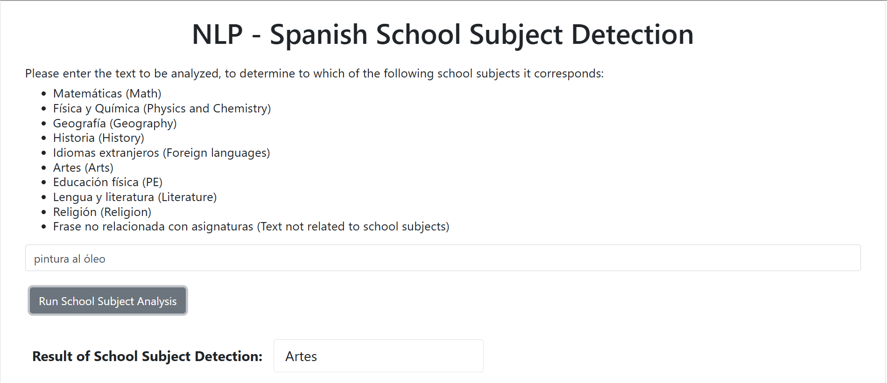

# 🚀 Finetuning BETO for Spanish Text Classification

This project demonstrates the process of fine-tuning the BETO model (a BERT-based model for Spanish) for text classification tasks. The notebook covers the training and validation steps, with a focus on obtaining the best model based on validation loss. Once the model is fine-tuned, the goal is to integrate it into a local Flask application for a more complete development cycle.

This project serves as a simple yet effective starting point for learning how to work with transformer models.

I hope you find it helpful or interesting. Feel free to clone and adapt it to your own projects!

🔗 [Dataset](https://huggingface.co/datasets/tonicanada/learn_hf_spanish_sentence_classification_by_school_subject)

🔗 [BETO Model](https://huggingface.co/dccuchile/bert-base-spanish-wwm-uncased)


# 🧠 Model Integration with Flask

Once the BETO model has been fine-tuned for classifying school subjects from Spanish sentences and locally saved, it is integrated into a local web application using Flask. This allows for real-time inference via a simple web interface.

The application structure includes a Python package named SchoolSubjectDetector, which contains:

`__init__.py`: Defines the package structure.

`school_subject_detection.py`: Contains the main classification function that loads the fine-tuned model and performs inference on user input.

The Flask application is launched using `app.py`, which defines the main endpoints and handles requests to the classification function.


# 🖥️ Frontend

A very simple frontend is included, built using basic HTML and JavaScript. While frontend development is not my primary focus (I'm much more comfortable on the backend!), this basic UI allows users to input a sentence and view the predicted school subject instantly.

# 📦 Requirements

A `requirements.txt` file is provided to help you set up a virtual environment and install all necessary dependencies to run the project locally.

To get started:

```console
python3 -m venv venv
source venv/bin/activate
pip install -r requirements.txt
```

Then you can launch the app with:

```bash flask --app app run```

# 🖼️ Preview

Here’s a preview of the app in action:

